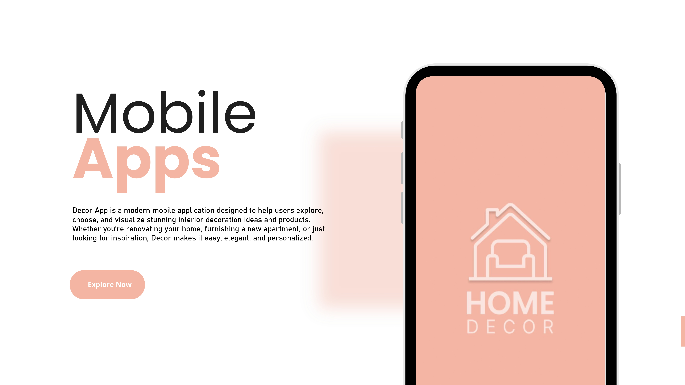
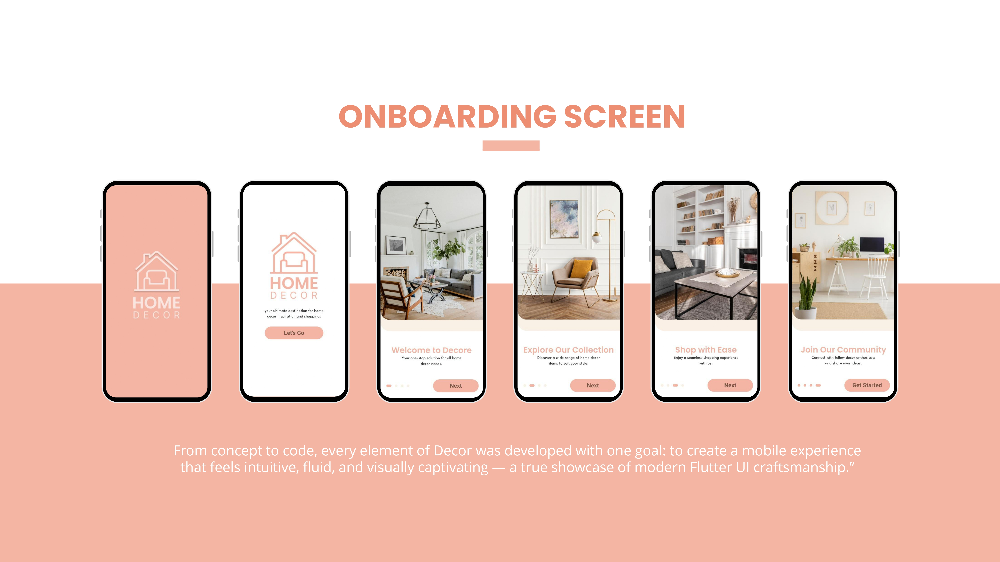
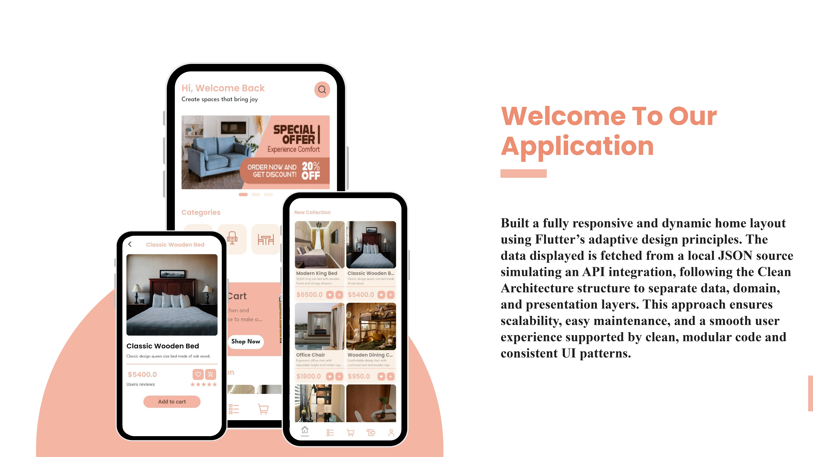
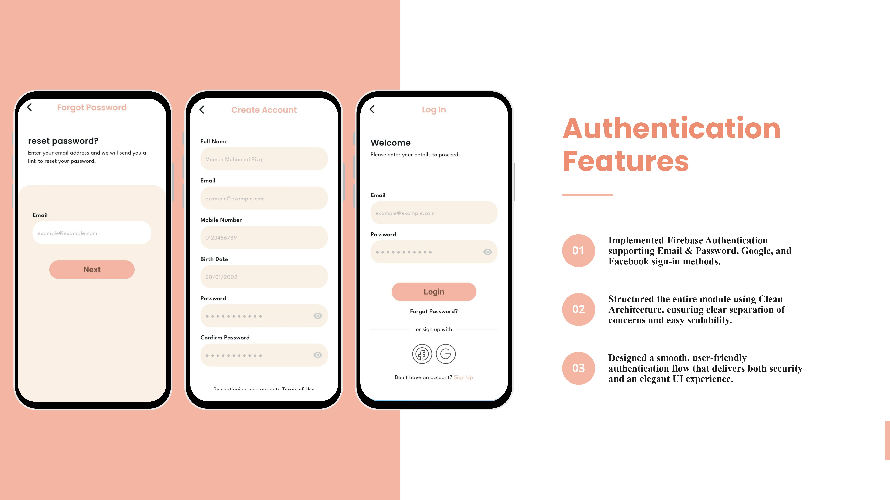
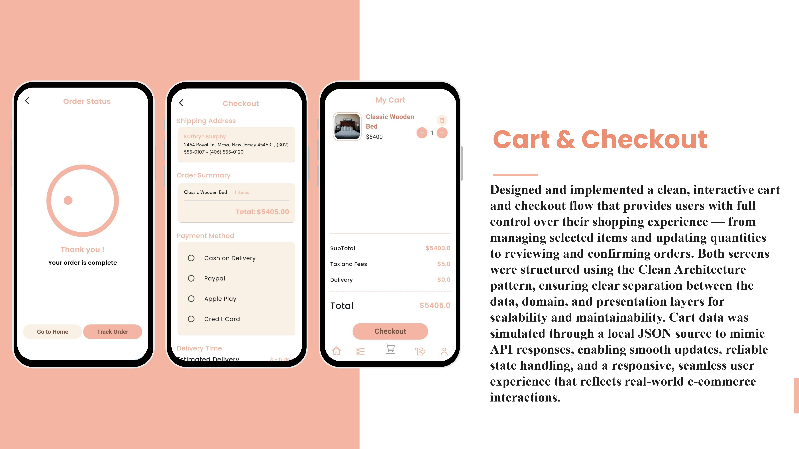
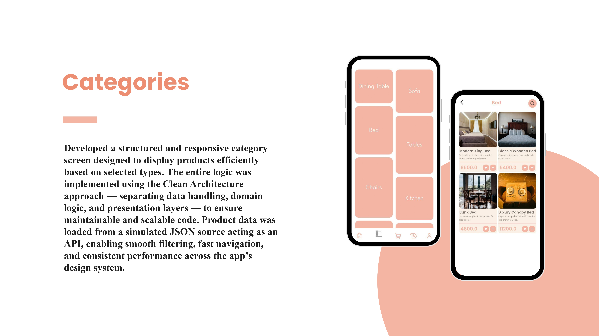

# Decor App

A fully structured Flutter mobile application for browsing and purchasing home decor products, designed with a scalable architecture and clean code principles.

---

## Overview

This project demonstrates a modern mobile shopping experience with a focus on clean architecture, state management, and modular development.  
It follows **Clean Architecture principles** and uses **Cubit (Bloc)** for state management to ensure maintainability and testability.

---

## Features

- 🏠 **Browse Products:** Explore a variety of home decor items with organized layouts.
- 🛒 **Cart Management:** Add, remove, and manage your cart items seamlessly.
- 💖 **Wishlist:** Save favorite products for later.
- 🔐 **Authentication:** Login using Email/Password, Google, or Facebook via Firebase Authentication.
- 💾 **Local JSON Simulation:** Mock backend responses with a local JSON file to simulate API integration.
- ⚙️ **Scalable Architecture:** Built using Clean Architecture and feature-based folder structure.
- 🔜 **Coming Soon:** Real backend integration and extended features.

---

## Tech Stack

- **Framework:** Flutter
- **Language:** Dart
- **State Management:** Cubit (Bloc)
- **Backend:** Firebase Authentication + Local JSON (mock data)
- **Architecture:** Clean Architecture

---

## Screenshots

| -------------------------------------------- | ----------------------------------------------- | --------------------------------------------- | ------------------------------------ |
|  |  |  |  |  |  |

---

## ⚙️ Installation & Setup

```bash

# Navigate to the project directory
cd home-decor-app

# Install dependencies
flutter pub get

# Run the app
flutter run
```
